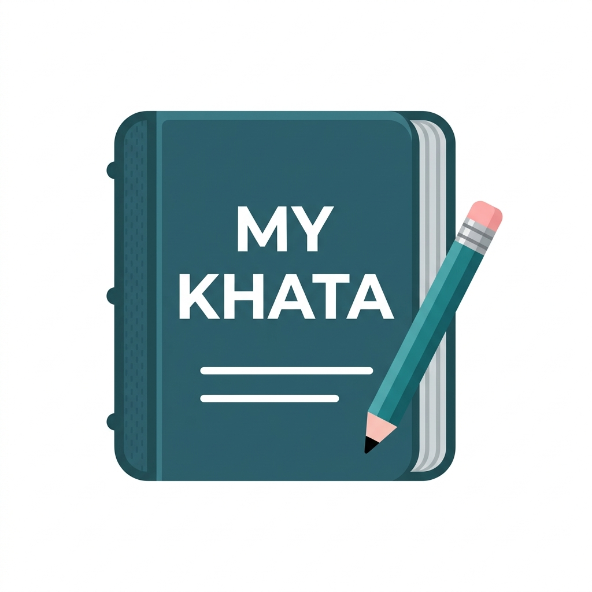
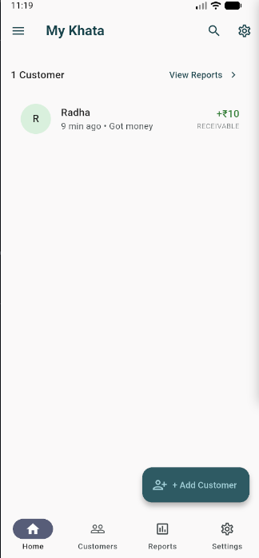
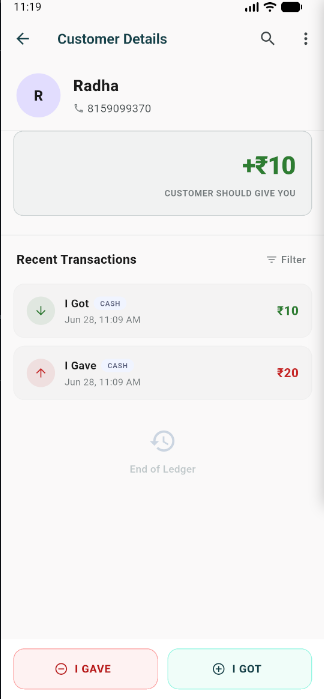
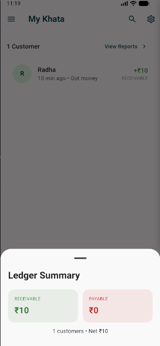
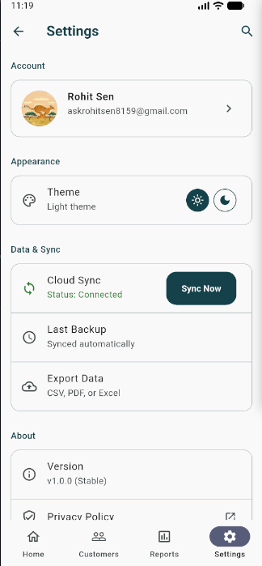

# 💰 My Khata - Simple Money Tracking

  
   
  <h3>Track money you give and receive with a simple digital ledger</h3>
  
  
  
  
🚀 <strong>55.5MB</strong> • 📱 <strong>Android 8.0+</strong> • 🆓 <strong>Free & Open Source</strong>

---

## 📱 App Screenshots

  
  
    
  

  <em>Secure Google Sign-In • Dashboard & Customer List • Transaction History • Settings & Themes</em>

---

## ✨ Key Features

### 🔐 **Secure Authentication**
- **Google Sign-In Integration** - Your data is protected with Firebase Authentication
- **No Guest Login** - Enhanced security with mandatory authentication
- **User Profile Management** - Automatic profile creation with Google account details

### 👥 **Smart Customer Management**
- **Add Customers** - Create customers with names, phone numbers, and notes
- **Quick Search** - Find customers instantly by name
- **Customer Dashboard** - View all customers with current balance status
- **Easy Organization** - Sort by recent activity or alphabetically

### 💸 **Lightning Fast Transactions**
- **Record in Seconds** - "I Gave" and "I Got" transactions in under 5 seconds
- **Automatic Calculations** - Real-time balance updates with precision
- **Transaction History** - Complete record with dates, amounts, and notes
- **Edit & Delete** - Modify transactions with automatic balance recalculation

### 📊 **Intelligent Balance Tracking**
- **Auto Balance Calculation** - See exactly who owes you and who you owe
- **Visual Indicators** - Green for money owed to you, red for money you owe
- **Summary Dashboard** - Total receivables, payables, and net balance
- **Instant Updates** - Balance changes immediately with each transaction

### 🎨 **Beautiful Modern Design**
- **Material 3 UI** - Latest Google design system with smooth animations
- **Dark & Light Themes** - Automatic system theme detection and manual switching
- **Responsive Layout** - Optimized for all Android screen sizes
- **Clean Interface** - Intuitive navigation focused on speed and simplicity

### ☁️ **Smart Data Management**
- **Offline-First Architecture** - Full functionality without internet connection
- **Automatic Cloud Sync** - Seamless synchronization when internet is available
- **Cross-Device Access** - Your data syncs across all your Android devices
- **Data Privacy** - Your financial information stays secure and private

### ⚙️ **Flexible Settings**
- **Theme Preferences** - Choose Light, Dark, or follow system setting
- **Profile Management** - View and manage your Google account information
- **Sync Status** - Real-time indicator of cloud synchronization status
- **Account Controls** - Complete account and data deletion options

---

## 🚀 Quick Installation Guide

### Step 1: Download
Click the **Download APK** button above or visit the [releases page](https://github.com/0xrohitsen/MyKhata/releases)

### Step 2: Enable Installation
On your Android device, go to **Settings > Security > Install Unknown Apps** and enable installation for your browser

### Step 3: Install
Open the downloaded APK file and tap **Install**

### Step 4: Sign In
Launch the app and sign in with your Google account to start tracking!

---

## 🎯 Perfect For

### 🏪 **Small Business Owners**
- Track customer credit and payments
- Manage multiple customer accounts
- Quick transaction recording during busy hours
- Offline functionality for areas with poor connectivity

### 💼 **Freelancers & Consultants**
- Monitor client payment status
- Record project payments and advances
- Keep track of outstanding invoices
- Professional transaction history

### 👥 **Personal Use**
- Track money lent to friends and family
- Manage shared expenses and IOUs
- Keep record of informal loans
- Avoid awkward money conversations

### 📝 **Digital Ledger Users**
- Replace traditional paper khata books
- Secure cloud backup of financial records
- Search and filter transaction history
- No risk of losing physical records

---

## 🛠️ Technology & Architecture

### **Built With Modern Technologies**
- **Flutter Framework** - Cross-platform mobile development
- **Firebase Backend** - Google's robust cloud infrastructure
- **Material 3 Design** - Latest UI/UX standards
- **Dart Language** - Type-safe, performance-optimized

### **Clean Architecture**
- **Separation of Concerns** - Maintainable and scalable codebase
- **Riverpod State Management** - Reactive and efficient state handling
- **Repository Pattern** - Abstracted data access layer
- **Clean Code Principles** - Professional development practices

### **Security & Privacy**
- **End-to-End Encryption** - All data encrypted in transit
- **Server-Side Security Rules** - Firestore security ensures data isolation
- **No Third-Party Sharing** - Your data never leaves Firebase ecosystem
- **GDPR Compliant** - Complete account deletion support

---

## 📊 App Specifications

| Feature | Details |
|---------|---------|
| **Platform** | Android 8.0+ (API 26) |
| **File Size** | 55.5MB APK |
| **Language** | English |
| **Currency** | ₹ (Indian Rupee) |
| **Internet** | Works offline, syncs online |
| **Storage** | Cloud-based with local caching |
| **Updates** | Automatic via GitHub releases |

---

## 🌟 Why Choose My Khata?

### ⚡ **Speed & Simplicity**
No complex accounting features - just fast, simple money tracking that works

### 🔒 **Security First**
Your financial data is protected with enterprise-grade security

### 📱 **Offline Ready**
Never lose productivity due to poor internet connectivity

### 🆓 **Completely Free**
No ads, no subscriptions, no hidden costs - totally free forever

### 🌐 **Open Source**
Full transparency with source code available for review and contribution

---

## 💡 How It Works

### **Adding Customers**
1. Tap the **+** button on the home screen
2. Enter customer name (required)
3. Optionally add phone number and notes
4. Save to create the customer profile

### **Recording Transactions**
1. Select a customer from your list
2. Tap **"I Gave"** (money you gave them) or **"I Got"** (money they gave you)
3. Enter the amount and optional note
4. Save - balance updates automatically!

### **Viewing Balances**
- **Green amounts** = Money owed to you
- **Red amounts** = Money you owe them  
- **Gray "Settled"** = No pending balance

### **Managing Data**
- Edit transactions by long-pressing them
- Delete customers with confirmation dialog
- Search customers using the search icon
- All changes sync automatically to cloud

---

## 🚧 Roadmap & Future Updates

### **Version 1.1 (Coming Soon)**
- Performance optimizations
- Enhanced error handling
- UI/UX improvements
- Bug fixes based on user feedback

### **Version 2.0 (Planned)**
- **iOS Support** - Native iPhone and iPad app
- **PDF Export** - Generate transaction reports
- **Multi-Currency** - Support for USD, EUR, and other currencies
- **Payment Reminders** - Notification system for outstanding amounts
- **Advanced Analytics** - Charts and insights for your financial data
- **WhatsApp Integration** - Share statements directly

---

## 💝 Open Source Contribution

My Khata is proudly **open source** under the MIT License! 

### **Ways to Contribute:**
- ⭐ **Star the repository** to show your support
- 🐛 **Report bugs** by creating issues
- 💡 **Suggest features** for future versions
- 🔧 **Submit pull requests** to improve the code
- 📖 **Improve documentation** and help others
- 🌍 **Translate the app** to your local language

### **For Developers:**
The codebase follows Clean Architecture principles with Flutter and Firebase. Check out the `lib/` folder for the complete source code, and feel free to fork and contribute!

---

## 👨‍💻 About the Developer

**My Khata** is developed by **Rohit Sen**, a passionate mobile app developer focused on creating simple, effective solutions for everyday problems.

- **GitHub**: [@0xrohitsen](https://github.com/0xrohitsen)
- **Philosophy**: Technology should simplify life, not complicate it
- **Focus**: Building apps that solve real problems for real people

---

  <h3>🙏 Thank You</h3>
  
Thank you for choosing My Khata! Your trust in our app motivates us to keep improving.

  
⭐ <strong>If this app helps you, please star the repository!</strong> ⭐

   
  
<em>Made with ❤️ for the community</em>

