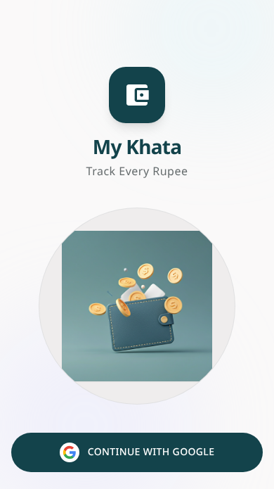
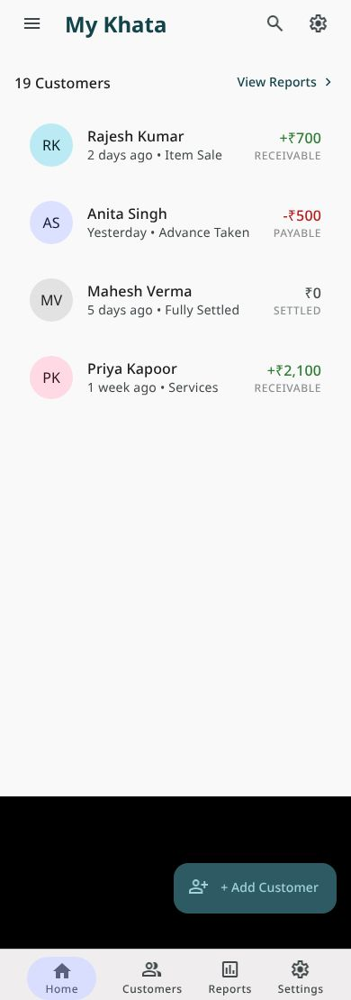
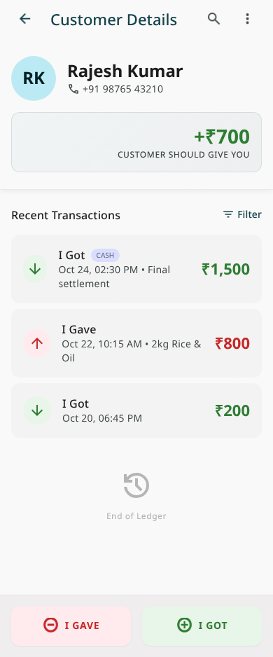

# 💰 My Khata - Simple Money Tracking

<div align="center">
  
  
  
  
  
</div>

<div align="center">
  
</div>

**My Khata** is a lightweight personal ledger app that helps users track money given to and received from customers, friends, or family. Built with Flutter and Firebase, it focuses on speed and simplicity - record a transaction in under 5 seconds!

## ✨ Features

- 🔐 **Secure Google Sign-In** - Your data is protected with Firebase Authentication
- 👥 **Customer Management** - Add and organize customers with names, phone numbers, and notes
- 💸 **Quick Transactions** - Record "I Gave" and "I Got" transactions instantly
- 📊 **Automatic Balance Calculation** - See who owes you and who you owe at a glance
- 📱 **Modern Material 3 UI** - Clean, intuitive interface with dark/light theme support
- 🌐 **Offline Support** - Full functionality without internet, syncs when reconnected
- ☁️ **Cloud Sync** - Your data syncs automatically across devices
- 🔍 **Smart Search** - Find customers quickly by name
- 🗑️ **Data Management** - Edit or delete transactions with automatic balance updates

## 📸 Screenshots

<div align="center">
  
  
  
</div>

## 🚀 Download

### Latest Release (v1.0.0)
[](https://github.com/0xrohitsen/MyKhata/releases/download/v1.0.0/app-release.apk)

**File Size:** 55.5MB  
**Minimum Android Version:** Android 8.0 (API 26)  
**Target SDK:** Android 15 (API 35)

## 🛠️ Technology Stack

- **Frontend:** Flutter (Latest Stable)
- **Language:** Dart with null safety
- **Authentication:** Firebase Authentication (Google Sign-In)
- **Database:** Cloud Firestore with offline persistence
- **State Management:** Riverpod
- **Architecture:** Clean Architecture (Data/Domain/Presentation layers)
- **Routing:** go_router
- **UI Framework:** Material 3 Design

## 🏗️ Architecture

```
lib/
├── main.dart
├── app.dart                     # MaterialApp configuration
├── core/
│   ├── constants/              # App constants
│   ├── theme/                  # Light/Dark themes
│   ├── router/                 # Navigation routes
│   └── utils/                  # Utility functions
├── features/
│   ├── auth/                   # Authentication
│   ├── customers/              # Customer management
│   ├── transactions/           # Transaction handling
│   └── settings/               # App settings
└── shared/
    └── widgets/                # Reusable widgets
```

## 🗄️ Database Structure

```
users (collection)
 └── {uid} (document)
      ├── profile: {
      │     name, email, photoUrl,
      │     themePreference, createdAt
      │   }
      │
      └── customers (subcollection)
           └── {customerId} (document)
                ├── name, phone, notes, balance
                ├── createdAt, updatedAt
                │
                └── transactions (subcollection)
                     └── {transactionId} (document)
                          ├── type: "gave" | "got"
                          ├── amount: number (in paise)
                          ├── note, createdAt
```

## 🚀 Getting Started

### Prerequisites

- Flutter SDK (latest stable)
- Android Studio / VS Code
- Firebase CLI
- Git

### Installation

1. **Clone the repository**
   ```bash
   git clone https://github.com/0xrohitsen/MyKhata.git
   cd MyKhata
   ```

2. **Install dependencies**
   ```bash
   flutter pub get
   ```

3. **Firebase Setup**
   - Create a new Firebase project
   - Enable Google Sign-In authentication
   - Add Android app with package name `com.mykhata.ask`
   - Download `google-services.json` to `android/app/`
   - Deploy Firestore security rules

4. **Generate release keystore** (for signed builds)
   ```bash
   cd android
   keytool -genkey -v -keystore my_khata_key.jks -keyalg RSA -keysize 2048 -validity 10000 -alias my_khata_key
   ```

5. **Build the app**
   ```bash
   flutter build apk --release
   # or for app bundle
   flutter build appbundle --release
   ```

### Running the App

```bash
flutter run
```

## 📋 Firebase Configuration

### Firestore Security Rules

```javascript
rules_version = '2';
service cloud.firestore {
  match /databases/{database}/documents {
    match /users/{userId} {
      allow read, write: if request.auth != null && request.auth.uid == userId;
      
      match /customers/{customerId} {
        allow read, write: if request.auth != null && request.auth.uid == userId;
        
        match /transactions/{transactionId} {
          allow read, write: if request.auth != null && request.auth.uid == userId;
        }
      }
    }
  }
}
```

## 🎯 Core Principles

1. **Speed First** - Record transactions in under 5 seconds
2. **Clean UI** - Modern Material 3 design
3. **Offline-First** - Works without internet
4. **Privacy** - Your data stays private and secure
5. **Simplicity** - No complicated accounting features

## 👥 Target Users

- Small shop owners tracking customer credit
- Freelancers managing client payments
- Individuals lending/borrowing money with friends and family
- Anyone needing a simple digital alternative to paper ledgers

## 🔒 Privacy & Security

- All data is encrypted in transit
- User authentication via Google Sign-In
- Data isolation - users can only access their own records
- Account deletion support for GDPR compliance
- No third-party data sharing

## 📱 Supported Platforms

- ✅ Android 8.0+ (API 26)
- ❌ iOS (planned for v2)
- ❌ Web (not planned)

## 🗺️ Roadmap

### v1.0.0 (Current) ✅
- Google Sign-In authentication
- Customer and transaction management
- Offline support with cloud sync
- Material 3 UI with dark/light themes

### v2.0.0 (Future)
- PDF export functionality
- Payment reminders
- Multi-currency support
- iOS version
- WhatsApp sharing
- Advanced reporting

## 🤝 Contributing

Contributions are welcome! Please feel free to submit a Pull Request. For major changes, please open an issue first to discuss what you would like to change.

### Development Setup

1. Fork the repository
2. Create a feature branch (`git checkout -b feature/AmazingFeature`)
3. Commit changes (`git commit -m 'Add some AmazingFeature'`)
4. Push to branch (`git push origin feature/AmazingFeature`)
5. Open a Pull Request

## 🐛 Bug Reports

If you find a bug, please create an issue with:
- Device information
- Android version
- Steps to reproduce
- Expected vs actual behavior

## 📄 License

This project is licensed under the MIT License - see the [LICENSE](LICENSE) file for details.

## 👨‍💻 Author

**Rohit Sen**
- GitHub: [@0xrohitsen](https://github.com/0xrohitsen)
- Email: rohitsen@example.com

## 🙏 Acknowledgments

- Flutter team for the amazing framework
- Firebase for backend services
- Material Design team for the design system
- All contributors who helped make this project better

## 📞 Support

If you like this project, please give it a ⭐ on GitHub!

For support, email rohitsen@example.com or create an issue in this repository.

---

<div align="center">
  Made with ❤️ in India 🇮🇳
</div>